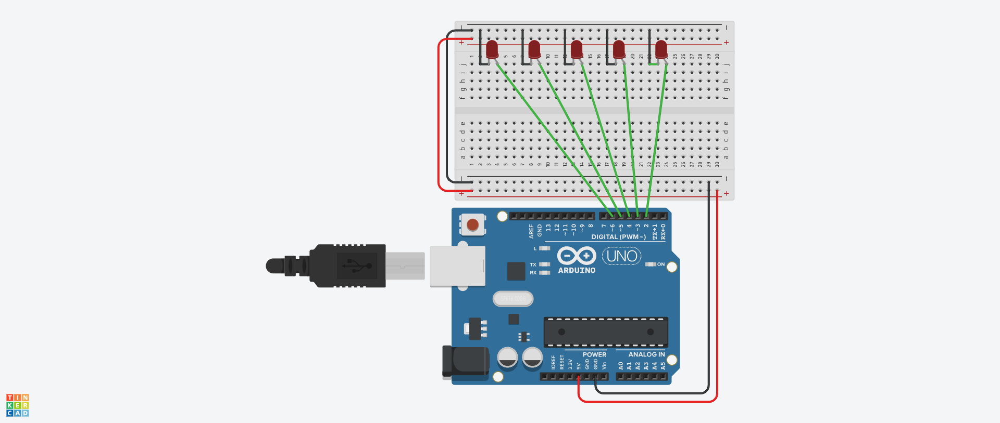

# hand-gesture-led-control
Control LEDs using hand gestures via OpenCV and Arduino

## 🔌 Circuit Diagram

The following image shows the circuit for connecting LEDs to Arduino:



- LED1 → Pin 2  
- LED2 → Pin 3  
- ...  
- GND → Common Ground

# 🤚 Hand Gesture LED Control using OpenCV & Arduino

This project lets you control 5 LEDs with simple hand gestures using a webcam and an Arduino Uno. It uses **OpenCV** and **MediaPipe** to detect finger gestures in real-time, and sends commands to Arduino to light up LEDs based on how many fingers are raised.

It’s a beginner-friendly project that combines computer vision and hardware interaction.

---

## 📁 Project Structure


hand-gesture-led-control/
├── Arduino/
│ └── led_control.ino # Arduino code to control the LEDs
├── Python/
│ └── hand_tracking_led.py # Python code to track hand gestures and send signals
├── .gitignore
├── LICENSE
└── README.md


---

## 🔌 Circuit Diagram

The circuit below shows how 5 LEDs are connected to the Arduino:


Each LED is connected to a digital pin on the Arduino, with a resistor in series to prevent overcurrent.

| LED Number | Arduino Pin |
|------------|-------------|
| LED 1      | D2          |
| LED 2      | D3          |
| LED 3      | D4          |
| LED 4      | D5          |
| LED 5      | D6          |

Make sure all LED cathodes are connected to GND, and use 220Ω resistors on the anode side.

---

## 🛠 What You’ll Need

- Arduino Uno R3
- 5 LEDs
- 5 × 220Ω resistors
- Breadboard + jumper wires
- USB cable
- PC or laptop with Python installed
- Webcam (built-in or external)

---

## 💡 How It Works

1. The webcam captures your hand in real-time.
2. The Python script processes the hand using MediaPipe and checks how many fingers are up.
3. Based on the number of raised fingers (0 to 5), a number is sent via serial to the Arduino.
4. The Arduino receives the number and turns ON that many LEDs starting from pin 2.

**Example:**
- Raise 3 fingers → LEDs on D2, D3, D4 turn ON  
- Fist (0 fingers) → All LEDs OFF

---

## 🧪 Getting Started
```bash

### Step 1: Install Python Dependencies

pip install opencv-python mediapipe pyserial

```
Step 2: Run the Python Script
Open the Python file from the Python folder and make sure the serial port (e.g., COM3, /dev/ttyUSB0) matches your Arduino.
```
```
```bash
python hand_tracking_led.py

```
Step 3: Upload Arduino Code
Upload the led_control.ino from the Arduino folder to your Arduino using the Arduino IDE.

🚀 Possible Extensions
Use more complex gestures to control different devices

Replace LEDs with relays to control appliances

Build a full hand-controlled interface for IoT or robotics


👨‍💻 Author
Adarsh Mecheril

Feel free to fork the project, suggest improvements, or contribute!


📄 License
This project is licensed under the MIT License.

---

✅ You can rename the circuit diagram image to `circuit_diagram.png` and place it inside an `images` folder for the image link to work.

Let me know if you'd like to embed a GIF demo or add screenshots as well.


